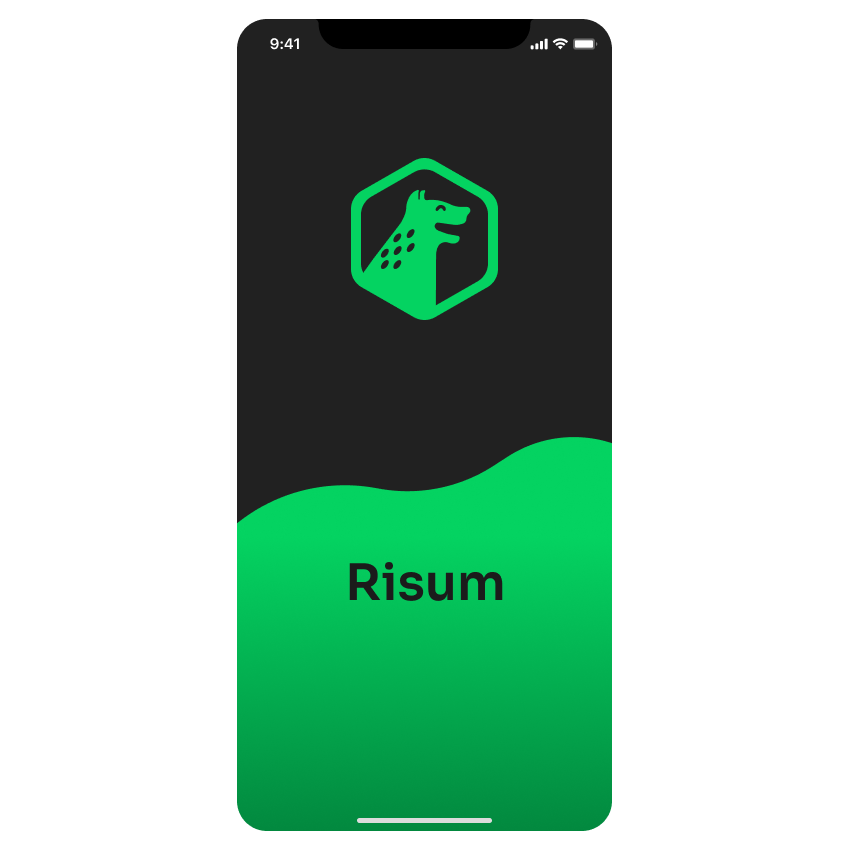

# Risum
Risum App made with React Native



## Setup project for coding
First of all, it's needed to have [Git](https://git-scm.com/downloads), [Node.js](https://nodejs.org/en/download/), [Yarn](https://yarnpkg.com/) and [Expo](https://expo.io/) installed on your system. After that, run these commands on your terminal:

```
# Install Expo Client
npm install -g expo-cli

# Clone the repository
git clone https://github.com/Risum-Corporation/risum.git

# Enter in the project folder
cd risum

# Install the dependencies
yarn

# Start Expo
expo start
```

Try the app!
